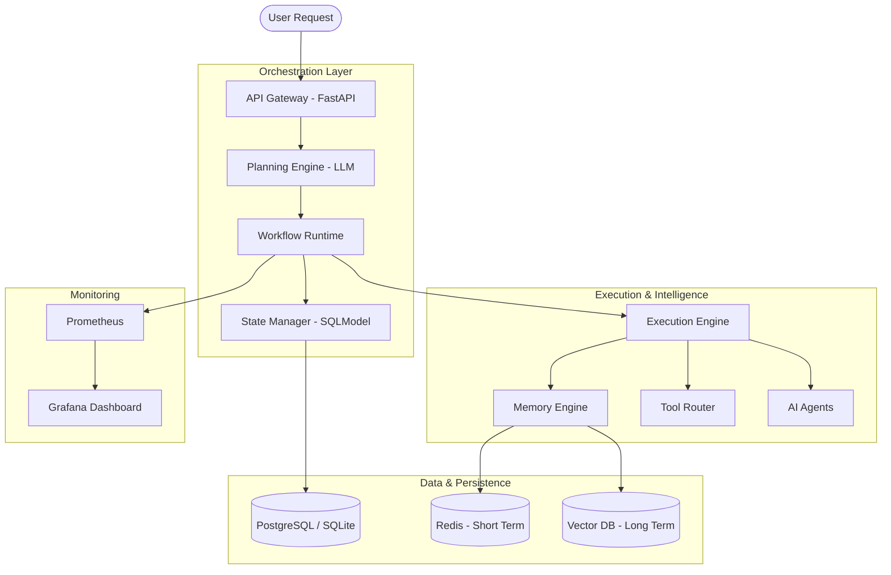

# NeuroVerse AI Orchestration Engine - Architecture Design

## 1. High-Level System Architecture

## 2. Component Breakdown

### A. API Gateway (FastAPI)
- Handles incoming REST requests.
- Validates input goals and initiates the orchestration sequence.

### B. Planning Engine (LLM)
- The "Brain" of the system.
- Uses models like **Llama 3** to decompose goals into structured tasks.

### C. Workflow Runtime
- Manages the lifecycle of a workflow.
- Handles task dependencies and retries.

### D. Memory Engine (Contextual Awareness)
- **Short-term Memory**: Redis for session context.
- **Long-term Memory**: Vector databases for historical data.

### E. Execution Engine
- Dispatches tasks to specific AI agents or external tools.

### F. State Manager
- Tracks the status of every workflow and task.
